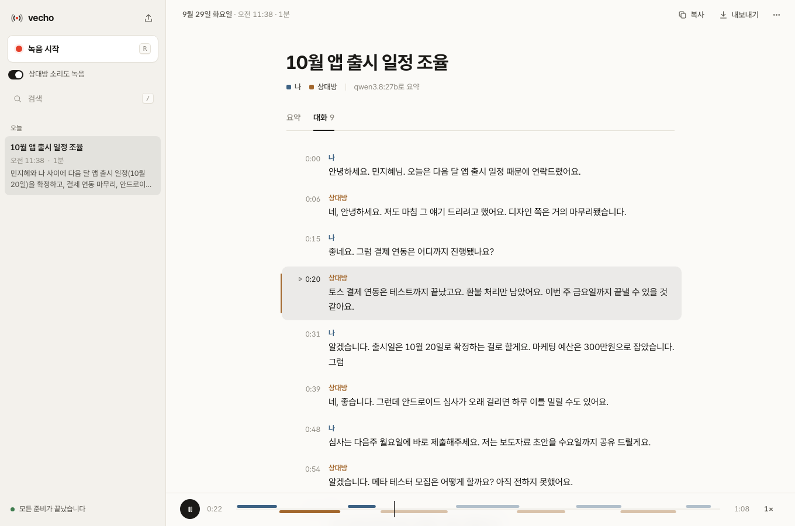

# vecho

양방향 음성 대화(화상회의, 통화, 인터뷰 등)를 **내 컴퓨터에서만** 녹음하고, 글로 옮기고, 요약하는 앱입니다.
macOS · Windows · Linux에서 같은 화면으로 동작합니다. 녹음 · 음성 인식 · 요약이 모두 로컬에서 실행되므로
음성과 대화 내용이 외부로 나가지 않습니다. (처음 한 번 모델 파일을 내려받을 때만 네트워크를 씁니다.)

```
마이크 ("나") ──────────┐                               ┌─ 대화 (대본 형식)
                       ├─ 트랙별 WAV ─ faster-whisper ─┤
시스템 오디오 ("상대방") ┘   (me / remote)   (STT, 로컬) └─ 요약 카드 ← Ollama (LLM, 로컬)
```

내 목소리(마이크)와 상대방 목소리(컴퓨터에서 재생되는 소리)를 **별도 트랙**으로 녹음하기 때문에,
화자 분리 모델 없이도 `나` / `상대방`이 정확히 구분됩니다.


## 사용법

```bash
vecho app
```

앱 창(또는 기본 브라우저)이 열립니다.

1. **녹음 시작** — 제목은 선택입니다. 통화·회의 전에 빨간 버튼을 누르세요.
2. **대화** — Discord, Zoom, Meet, 전화 앱 등 무엇이든 됩니다. 녹음 중에는 내 목소리와 상대방 소리가 각각 파형으로 표시되고, 제목도 이때 입력할 수 있습니다.
3. **중지하고 요약하기** — 자동으로 글로 옮기고 한 줄 요약 · 핵심 내용 · 결정 사항 · 액션 아이템(체크 가능) · 미해결 질문으로 정리합니다.

그 밖에 할 수 있는 것:

- 왼쪽 목록에서 지난 대화를 **검색**하고 다시 보기
- **대화** 탭: 누가 언제 무슨 말을 했는지 대본처럼 보기. 시간을 누르면 그 부분부터 **재생** (1–2배속)
- 제목을 눌러 **이름 바꾸기**(녹음 중에도 가능), 요약 **복사**, Markdown으로 **내보내기**, `⋯` 메뉴에서 **다시 요약**·**삭제**
- 액션 아이템은 **체크**할 수 있고, 담당자와 기한이 따로 정리됩니다
- 음성 파일(mp3, m4a, wav …)을 창에 **끌어다 놓으면** 바로 요약
- 오른쪽 위 **준비 상태**: 마이크 · 상대방 소리 · 음성 인식 · 요약 AI 점검과 해결 방법
- 단축키: `R` 녹음/중지 · `/` 검색 · `Space` 재생/정지



화면은 시스템 언어(한국어/영어)와 다크 모드를 따르고, 좁은 창에서도 쓸 수 있습니다.
글꼴은 [Pretendard](https://github.com/orioncactus/pretendard)(SIL OFL 1.1)를 앱에 포함해 어느 OS에서나 같은 모양으로 보입니다.
같은 기능을 터미널에서 쓰려면 아래 [명령어](#명령어)를 보세요.

## 설치

공통: Python 3.11 – 3.13, [uv](https://docs.astral.sh/uv/), [Ollama](https://ollama.com)

```bash
git clone https://github.com/Nhahan/vecho.git && cd vecho
uv tool install --python 3.12 --editable ".[desktop]"   # `vecho` 설치 (desktop: 전용 창, 빼면 브라우저)
ollama pull qwen3.8:27b                   # 기본 요약 모델 (약 17GB, 메모리 32GB 이상 권장)
vecho app
```

메모리가 적다면 더 작은 모델을 쓰세요: `ollama pull qwen3:8b` 후 `VECHO_LLM_MODEL=qwen3:8b` ([설정](#설정)).

### 상대방 소리는 어떻게 녹음되나요?

**가상 오디오 드라이버, 관리자 권한, 소리 설정 변경이 필요 없습니다.** 컴퓨터에서 재생되는 소리를 그대로 녹음하므로
스피커·이어폰·헤드셋 어느 것으로 듣든, 통화 중에 바꿔도 계속 녹음되고 내가 듣는 소리에는 영향이 없습니다.

| OS | 방식 | 필요한 것 |
| --- | --- | --- |
| macOS 14.4+ | Core Audio 프로세스 탭 | Xcode Command Line Tools (`xcode-select --install`, 첫 녹음 때 캡처 도우미를 한 번 컴파일). 처음 녹음할 때 **시스템 오디오 녹음** 권한을 허용 |
| Windows 10/11 | WASAPI 루프백 | 없음 |
| Linux | PulseAudio / PipeWire 모니터 | `pipewire-pulse` 또는 PulseAudio (대부분의 데스크톱 배포판에 기본 포함) |

상대방 소리가 녹음되지 않았다면 앱이 종료 직후 원인과 해결 방법을 알려줍니다. (macOS에서는 대개
시스템 설정 → 개인정보 보호 및 보안 → **화면 및 시스템 오디오 녹음**에서 앱/터미널을 허용하면 해결됩니다.)

> 이어폰을 쓰면 가장 깨끗합니다. 스피커로 들으면 상대방 소리가 마이크에 다시 들어가지만,
> **마이크 쪽 에코는 자동으로 제거**됩니다 (6글자 미만의 짧은 맞장구는 구분이 어려워 그대로 둡니다).

<details>
<summary>macOS 14.4 미만 (BlackHole 사용)</summary>

시스템 오디오 캡처를 쓸 수 없는 구형 macOS에서는 루프백 장치로 대체됩니다.

```bash
brew install --cask blackhole-2ch switchaudio-osx   # BlackHole 설치는 관리자 비밀번호 필요
sudo killall coreaudiod                             # 드라이버 로드 (재부팅해도 됨)
```

녹음하는 동안에만 현재 출력 장치와 BlackHole로 동시에 내보내는 `vecho Multi-Output`을 만들어 선택하고,
종료하면 원래 출력으로 되돌립니다(통화 중 출력이 바뀌면 따라갑니다). `vecho record --no-routing`으로
자동 전환을 끌 수 있고, `vecho setup [--remove]`로 장치를 미리 만들거나 지울 수 있습니다.
이 방식에서는 앱의 출력 장치가 **기본값**이어야 합니다.

</details>

### 저장 위치와 개인정보

모든 데이터는 `~/.vecho/sessions/<날짜-제목>/`에 저장됩니다 (Windows: `C:\Users\<이름>\.vecho`).

| 파일 | 내용 |
| --- | --- |
| `me.wav`, `remote.wav` | 트랙별 원본 녹음 (16 kHz, mono) |
| `transcript.md` / `transcript.json` | 타임스탬프와 화자가 붙은 전사문 |
| `summary.md` | 요약 |
| `session.json` | 제목, 시간, 사용한 모델, 녹음 중 생긴 문제 |

앱은 `127.0.0.1`에서만 열리고, 실행할 때마다 바뀌는 접근 토큰이 있어 다른 웹사이트가 녹음을 조작할 수 없습니다.
전사나 요약이 실패해도 **녹음은 항상 보존**되며, 앱에서 **다시 시도**를 누르면 됩니다.

## 명령어

| 명령 | 설명 |
| --- | --- |
| `vecho app` | 앱 열기 (`--browser` 브라우저로, `--no-open` 서버만, `--port`) |
| `vecho setup` | (구형 macOS·BlackHole 전용) Multi-Output 장치 미리 만들기 / `--remove` 삭제 |
| `vecho record` | 터미널에서 녹음, Ctrl+C로 종료하면 전사·요약 (`--no-process`로 녹음만) |
| `vecho import --me a.wav --remote b.wav` | 이미 있는 오디오 파일로 세션 생성 (`--mixed`는 한 파일에 양쪽이 섞인 경우) |
| `vecho transcribe [세션]` | 전사만 다시 실행 |
| `vecho summarize [세션]` | 요약만 다시 실행 (모델/언어를 바꿔 재요약 가능) |
| `vecho list` | 세션 목록 |
| `vecho show [세션]` | 요약 출력 (`--transcript` 전사문, `--path` 폴더 경로) |
| `vecho devices` | 오디오 입력 장치 목록 (`loopback` 표시) |
| `vecho doctor` | 마이크 · 시스템 오디오 캡처 · Whisper · Ollama 점검 |

`[세션]`에는 전체 ID, 앞부분(prefix), 일부 문자열 또는 `latest`(기본값)를 쓸 수 있습니다.

자주 쓰는 옵션:

```bash
vecho record --mic "MacBook"                     # 마이크를 이름 일부 또는 번호로 지정
vecho record --remote blackhole                   # 시스템 오디오 대신 특정 입력 장치 사용
vecho record --mic-only                           # 상대방 소리 없이 마이크만 녹음
vecho record --model small --language ko          # 더 가벼운 Whisper 모델
vecho summarize --llm-model gemma3:12b --summary-language English
```

## 설정

우선순위: 기본값 < `~/.vecho/config.toml` < `VECHO_*` 환경 변수 < 명령행 옵션.

```toml
# ~/.vecho/config.toml
whisper_model = "large-v3-turbo"   # tiny / base / small / medium / large-v3 ...
language = "ko"                    # 생략하면 자동 감지
llm_model = "qwen3.8:27b"
summary_language = "Korean"
me_label = "나"
remote_label = "상대방"
```

| 설정 | 환경 변수 | 기본값 |
| --- | --- | --- |
| `whisper_model` | `VECHO_WHISPER_MODEL` | `large-v3-turbo` |
| `whisper_compute_type` | `VECHO_WHISPER_COMPUTE_TYPE` | `int8` |
| `language` | `VECHO_LANGUAGE` | 자동 감지 |
| `llm_host` | `VECHO_LLM_HOST` | `http://127.0.0.1:11434` |
| `llm_model` | `VECHO_LLM_MODEL` | `qwen3.8:27b` |
| `llm_num_ctx` | `VECHO_LLM_NUM_CTX` | `32768` |
| `llm_timeout` | `VECHO_LLM_TIMEOUT` | `1800` (초) |
| `chunk_chars` | `VECHO_CHUNK_CHARS` | `16000` |
| `summary_language` | `VECHO_SUMMARY_LANGUAGE` | `Korean` |
| `sample_rate` | `VECHO_SAMPLE_RATE` | `16000` |
| `me_label` / `remote_label` | `VECHO_ME_LABEL` / `VECHO_REMOTE_LABEL` | `나` / `상대방` |
| — | `VECHO_HOME` | `~/.vecho` |

> 기본값은 메모리가 넉넉한 Mac(예: 64GB 이상)을 기준으로 잡았습니다. 메모리가 작다면
> `VECHO_LLM_MODEL=qwen3:8b VECHO_LLM_NUM_CTX=8192 VECHO_CHUNK_CHARS=6000`처럼 낮추세요.
> `chunk_chars`는 `llm_num_ctx`의 절반 이하(한국어 기준 토큰 ≈ 글자 수)로 유지해야 잘리지 않습니다.

긴 대화는 `chunk_chars` 단위로 나누어 부분 노트를 만든 뒤 하나의 요약으로 합칩니다(map-reduce).
그래서 컨텍스트 창보다 긴 회의도 요약할 수 있습니다.

## 개발

```bash
uv sync
uv run pytest        # 마이크·모델·Ollama 없이 실행되는 단위 테스트
uv run ruff check .
```

## 주의

- **녹음에는 상대방의 동의가 필요할 수 있습니다.** 통화·회의를 녹음하기 전에 참석자에게 알리고 지역 법규를 확인하세요.
- 음성 인식은 완벽하지 않으므로 중요한 결정 사항은 `transcript.md`와 대조해 확인하세요.
- 처음 마이크를 사용할 때 macOS가 터미널 앱의 마이크 접근 권한을 묻습니다. 허용해야 녹음됩니다.

## 라이선스

[MIT](LICENSE)
