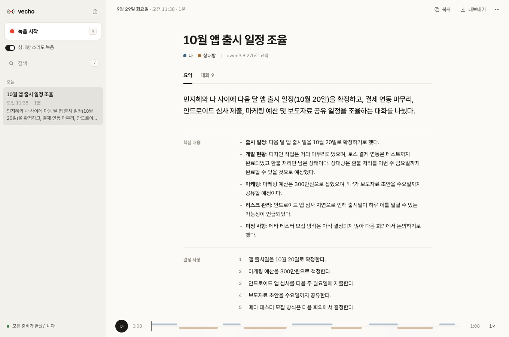

# vecho

대화를 녹음하고 요약합니다.



## 설치

macOS

```
curl -fsSL https://raw.githubusercontent.com/Nhahan/vecho/main/install.sh | sh
```

Windows (PowerShell)

```
irm https://raw.githubusercontent.com/Nhahan/vecho/main/install.ps1 | iex
```

업데이트할 때도 같은 명령을 실행하면 됩니다. 삭제는 `install`을 `uninstall`로 바꿔 실행하세요.

## 사용

vecho를 열고 **녹음 시작**을 누르세요. 녹음을 멈추면 대화 기록과 요약이 만들어집니다.

자세한 설명은 [docs/GUIDE.md](docs/GUIDE.md)에 있습니다.
